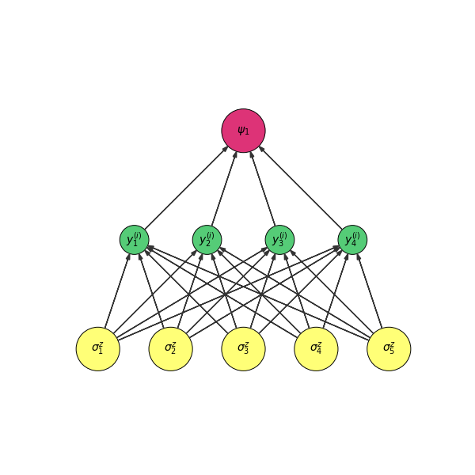

# Viznet - A Neural Network visualization toolbox

## To Run a Sample
```bash
    $ python -m viznet.tests.test_netbasic
```

I created a theme set Following Neural [Zoo Page](http://www.asimovinstitute.org/neural-network-zoo/), Here is a table of configuration:


```python
NODE_THEME_DICT = {
        'basic': (NONE, 'none'),
        'backfed': (YELLOW, 'circle'),
        'input': (YELLOW, 'none'),
        'noisy_input': (YELLOW, 'triangle'),
        'hidden': (GREEN, 'none'),
        'probablistic_hidden': (GREEN, 'circle'),
        'spiking_hidden': (GREEN, 'triangle'),
        'output': (RED, 'none'),
        'match_input_output': (RED, 'circle'),
        'recurrent': (BLUE, 'none'),
        'memory': (BLUE, 'circle'),
        'different_memory': (BLUE, 'triangle'),
        'kernel': (VIOLET, 'none'),
        'convolution': (VIOLET, 'circle'),
        'pooling': (VIOLET, 'circle'),
        }
```

## Example A: Restricted Boltzmann Machine

## Example B: Feed Forward Neural Network

