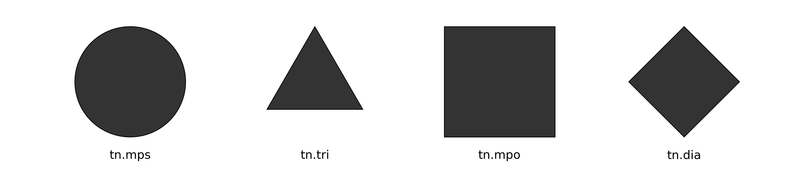
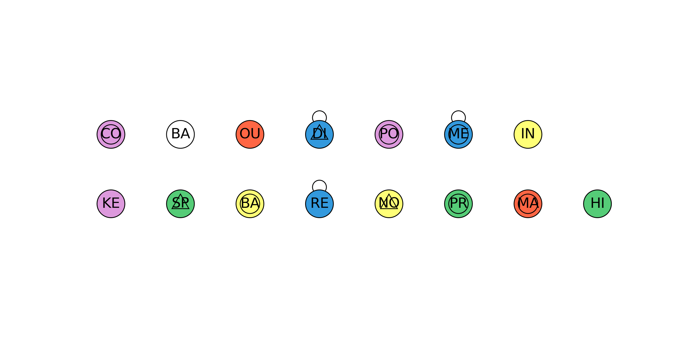
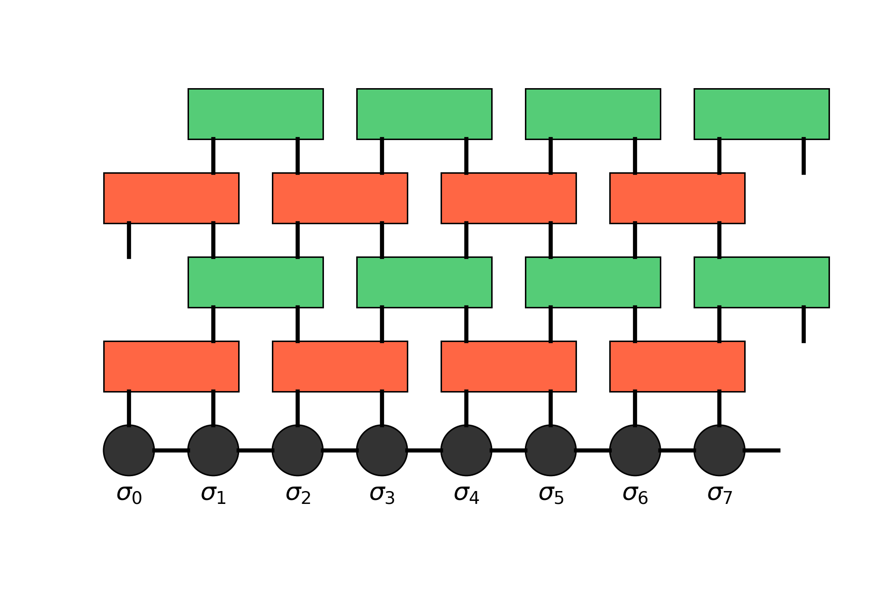
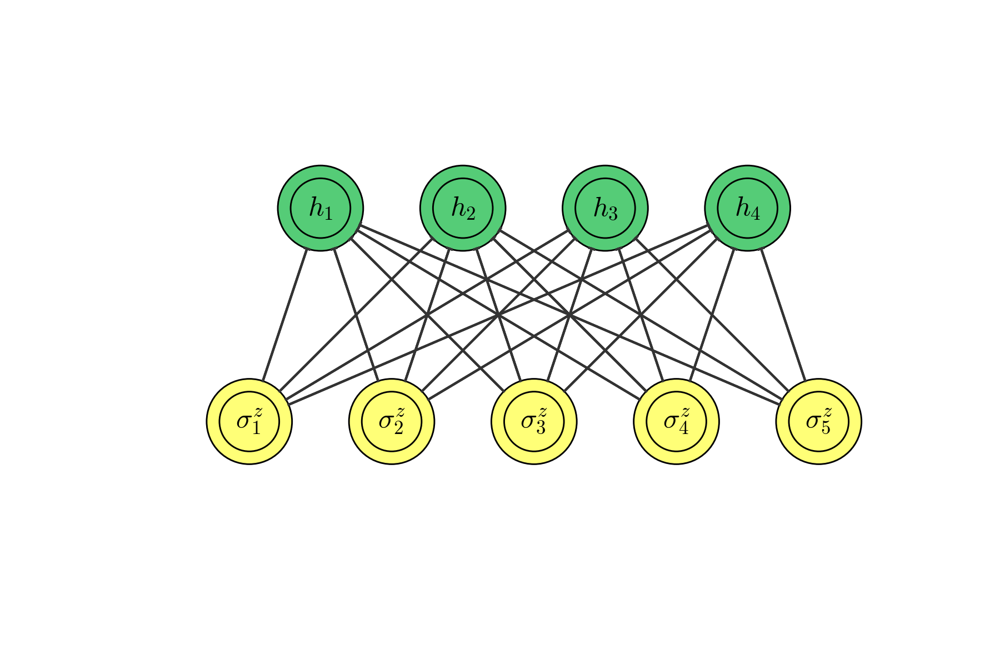
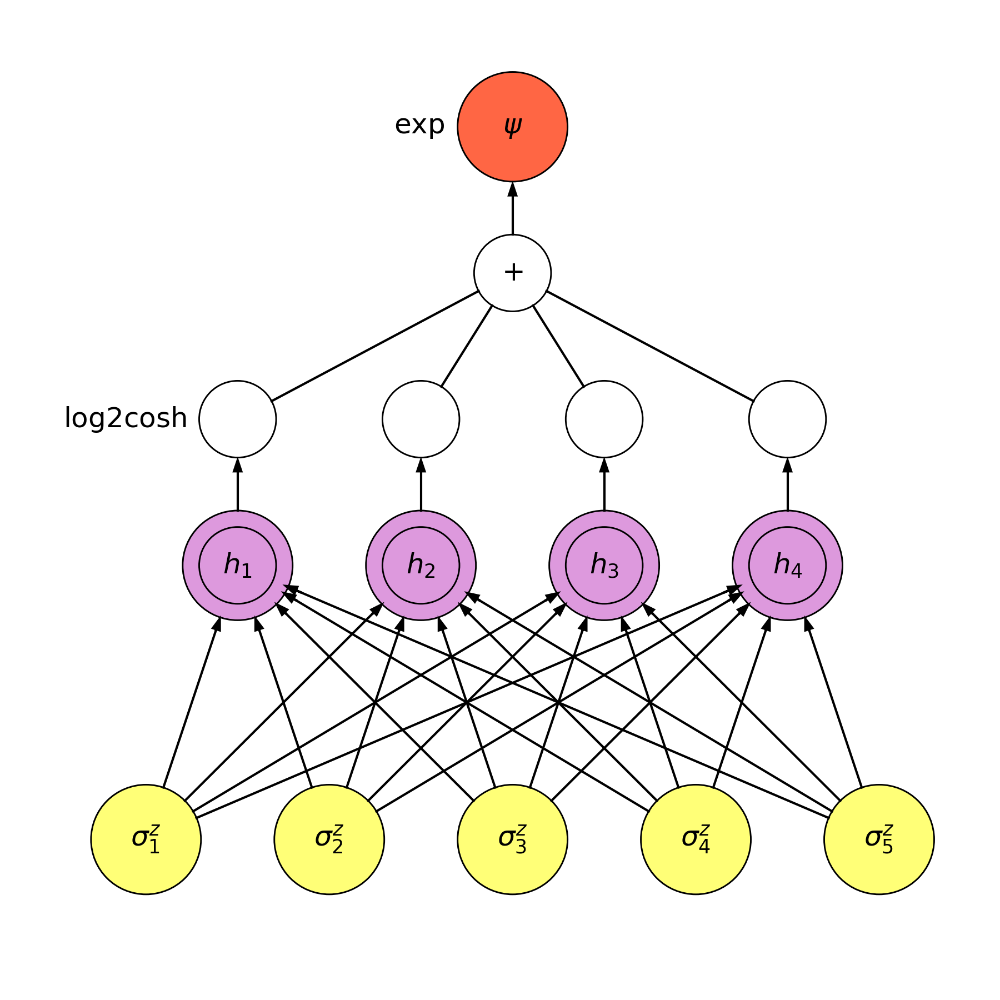

# Viznet - A Neural Network visualization toolbox

## To Run a Sample
```bash
    $ python -m viznet.tests.test_netbasic
```

I created a theme for neural network plotting following [Neural Network Zoo Page](http://www.asimovinstitute.org/neural-network-zoo/),
here is a table of node species:

For Neural Network, we have


For Tensor Network, we have



Besides, we have two basic types, basic and invisible.




```python
# COLOR | SHAPE | INSIDE_SHAPE
NODE_THEME_DICT = {
        'invisible': (None, 'circle', 'none'),
        'basic': (NONE, 'circle', 'none'),

        'nn.backfed': (YELLOW, 'circle', 'circle'),
        'nn.input': (YELLOW, 'circle', 'none'),
        'nn.noisy_input': (YELLOW, 'circle', 'triangle'),
        'nn.hidden': (GREEN, 'circle', 'none'),
        'nn.probablistic_hidden': (GREEN, 'circle', 'circle'),
        'nn.spiking_hidden': (GREEN, 'circle', 'triangle'),
        'nn.output': (RED, 'circle', 'none'),
        'nn.match_input_output': (RED, 'circle', 'circle'),
        'nn.recurrent': (BLUE, 'circle', 'none'),
        'nn.memory': (BLUE, 'circle', 'circle'),
        'nn.different_memory': (BLUE, 'circle', 'triangle'),
        'nn.kernel': (VIOLET, 'circle', 'none'),
        'nn.convolution': (VIOLET, 'circle', 'circle'),
        'nn.pooling': (VIOLET, 'circle', 'circle'),

        'tn.mps': (BLACK, 'circle', 'none'),
        'tn.tri': (BLACK, 'triangle', 'none'),
        'tn.tri_u': (BLACK, 'triangle-u', 'none'),
        'tn.tri_d': (BLACK, 'triangle-d', 'none'),
        'tn.tri_l': (BLACK, 'triangle-l', 'none'),
        'tn.tri_r': (BLACK, 'triangle-r', 'none'),
        'tn.mpo': (BLACK, 'square', 'none'),
        'tn.mpo21': (BLACK, 'rectangle-2-1', 'none'),
        'tn.mpo12': (BLACK, 'rectangle-1-2', 'none'),
}
```

## Example A: Time Evolving Block Decimation



```python
from viznet import theme, NodeBrush, EdgeBrush, DynamicShow

def tebd():
    with DynamicShow((6, 4), filename='tebd.png') as ds:
        # define a set of brushes.
        # NodeBrush can place a node at some location, like `node_brush >> (x, y)`,
        # and it will return a Node instance.
        # EdgeBrush can connect two Nodes (or Pin as a special Node),
        # like `edge_brush >> node_a, node_b`, and will return an Edge instance.
        size = 'normal'
        mps = NodeBrush('tn.mps', ds.ax, size=size)
        # invisible node can be used as a placeholder
        invisible_mps = NodeBrush('invisible', ds.ax, size=size)
        mpo21 = NodeBrush('tn.mpo21', ds.ax, size=size)
        edge = EdgeBrush('undirected', ds.ax, lw=2.)

        # add a sequence of mps nodes, a store them in a list for future use.
        mps_list = []
        for i in range(8):
            mps_list.append(mps >> (i, 0))
            mps_list[-1].text(r'$\sigma_%d$' % i, position='bottom')
        mps_list.append(invisible_mps >> (i + 1, 0))

        # add mpo and connect nodes
        for layer in range(4):
            # set brush color, it will overide theme color!
            # You can set brush color to None to restore theme color.
            mpo21.color = theme.RED if layer % 2 == 0 else theme.GREEN
            mpo_list = []
            start = layer % 2
            for i, (mps_l, mps_r) in enumerate(zip(mps_list[start::2],
                                                   mps_list[start + 1::2])):
                # place an two site mpo slightly above the center of two mps nodes
                mpo_list.append(mpo21 >> (mps_l.position +
                                          mps_r.position) / 2. + (0, layer + 1))
                if layer == 0:
                    # if this is the first mpo layer, connect mps and newly added mpo.
                    pin_l = mps_l
                    pin_r = mps_r
                else:
                    # otherwise, place a pin at the top surface of previous mpo,
                    # we also require it horizontally aligned to some `mps_l` object.
                    # pin is a special node, which is zero sized,
                    # we can use it to connect nodes, add texts.
                    # if you're about to place some pin at `left` or
                    # `right` surface of a node,
                    # align is then intepreted as vertial align.
                    pin_l = mpo_list_pre[i].pin('top', align=mps_l)
                    pin_r = mpo_list_pre[i].pin('top', align=mps_r)
                if layer < 2:
                    edge >> (mps_l, mps_r)
                edge >> (pin_l, mpo_list[-1].pin('bottom', align=mps_l))
                edge >> (pin_r, mpo_list[-1].pin('bottom', align=mps_r))
            mpo_list_pre = mpo_list


if __name__ == '__main__':
    tebd()
```

## Example B: Restricted Boltzmann Machine


## Example C: Convolutional Neural Network on quivalence of RBM

The code looks like
```python
from ..netbasic import DynamicShow, NNPlot

def draw_conv_rbm(ax, num_node_visible, num_node_hidden):
    '''CNN equivalance to RBM'''
    handler = NNPlot(ax)
    # visible layers
    handler.add_node_sequence(
        num_node_visible, '\sigma^z', 0, kind='input', radius=0.3)

    # hidden layers
    handler.add_node_sequence(num_node_hidden, 'h',
                              1.5, kind='convolution', radius=0.3)

    # nonlinear layers
    handler.add_node_sequence(num_node_hidden, 'nonlinear',
                              2.3, kind='basic', radius=0.15, show_name=False)
    handler.text_node_sequence('nonlinear', text_list=[r'$\log 2\cosh$'],
                               offset=(-0.6,-0.4))

    # sum, we do not show_name because name automatically generated
    # will be r"$+_1$" (with subscript)
    handler.add_node_sequence(1, '+',
                              3.1, kind='basic', radius=0.15, show_name=False)
    handler.text_node_sequence('+', text_list=[r'$+$'])

    # output
    handler.add_node_sequence(1, r'\psi',
                              3.9, kind='output', radius=0.3, show_name=False)
    handler.text_node_sequence(r'\psi', text_list=[r'$\psi$'], offset=(0,0.))

    # connect them
    handler.connect_layers('\sigma^z', 'h', directed=True)
    handler.connect_layers('h', 'nonlinear', directed=True, one2one=True)
    handler.connect_layers('nonlinear', '+', directed=False)
    handler.connect_layers('+', r'\psi', directed=True)

def test_conv_rbm():
    with DynamicShow((6, 6), '_conv_rbm.png') as d:
        draw_conv_rbm(d.ax, 5, 4)

if __name__ == '__main__':
    test_conv_rbm()
```
