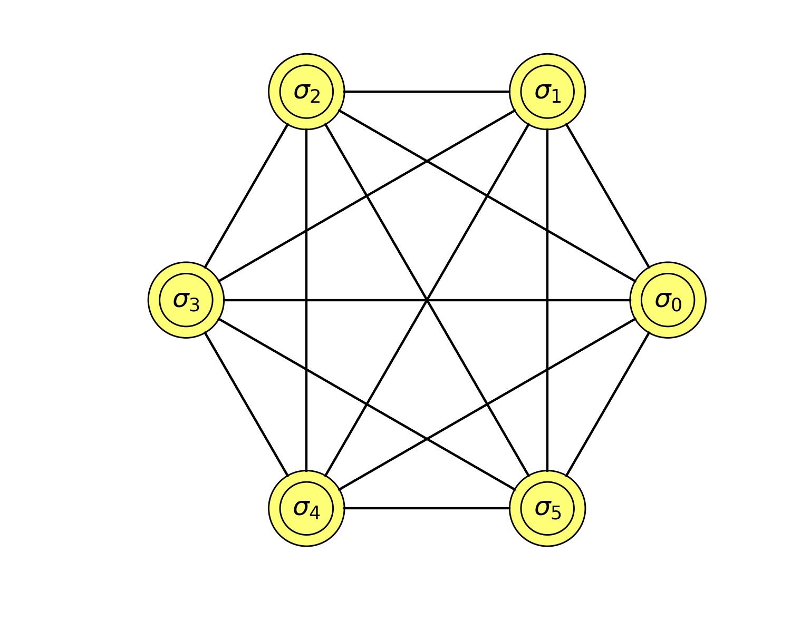

.. _examples:

Examples
========

.. toctree::
   :maxdepth: 2	

----------------------

The most basic example is mnist classification. It can be found in the examples-folder of Layers. The code looks as follows

.. literalinclude:: ../apps/nn/bm.py
	:tab-width: 2

.. code-block:: bash

	$ python apps/nn/bm.py

The output is 

