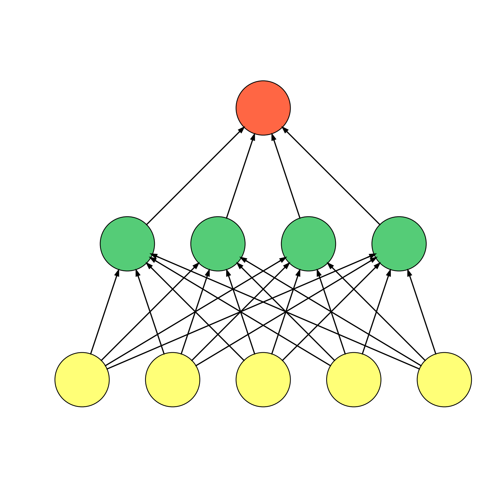
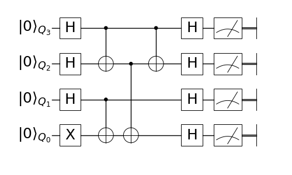

.. _examples:

Examples
========

.. toctree::
   :maxdepth: 2	

----------------------

The first example is a feed forward network

.. literalinclude:: ../apps/nn/feed_forward.py
	:tab-width: 2

.. code-block:: bash

	$ python apps/nn/feed_foward.py

The output is 

The second example is tensor network TEBD algorithm, it is also a good example to learn the grid system.

.. literalinclude:: ../apps/tn/tebd.py
	:tab-width: 2

.. code-block:: bash

	$ python apps/tn/tebd.py

The output is 

.. image:: images/tebd.png
    :align: center

The third example is a quantum circuit

.. literalinclude:: ../apps/qc/ghz.py
	:tab-width: 2

.. code-block:: bash

	$ python apps/qc/ghz.py

The output is 

Here, we used the :class:`QuantumCircuit` instance :obj:`handler` to help us build the circuit.
`gate` method of :obj:`handler` take brush(es) as first argument and line(lines) as second argument.
`handler.x` decide the `x` axis of this gate.
