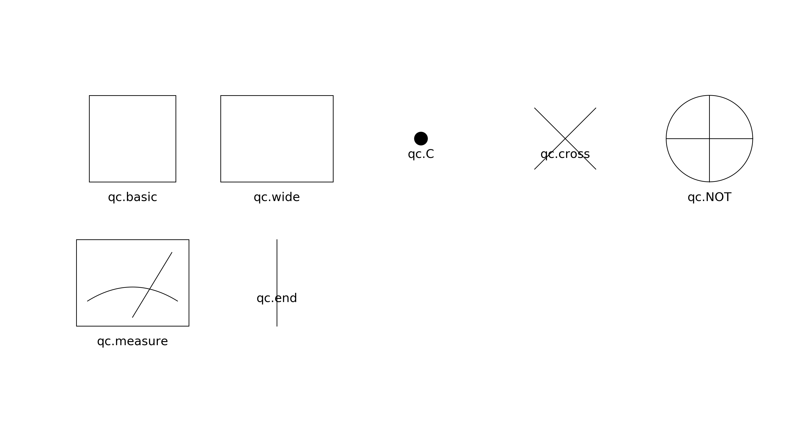
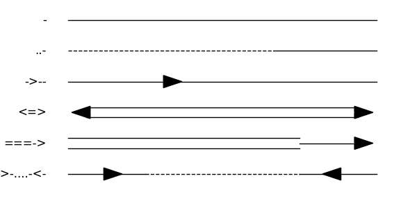
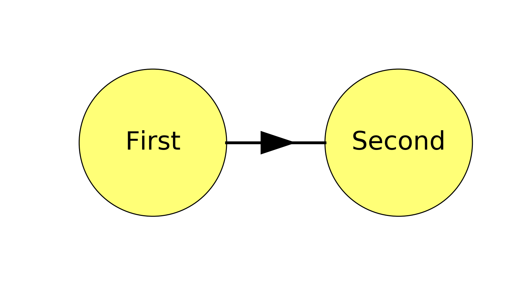
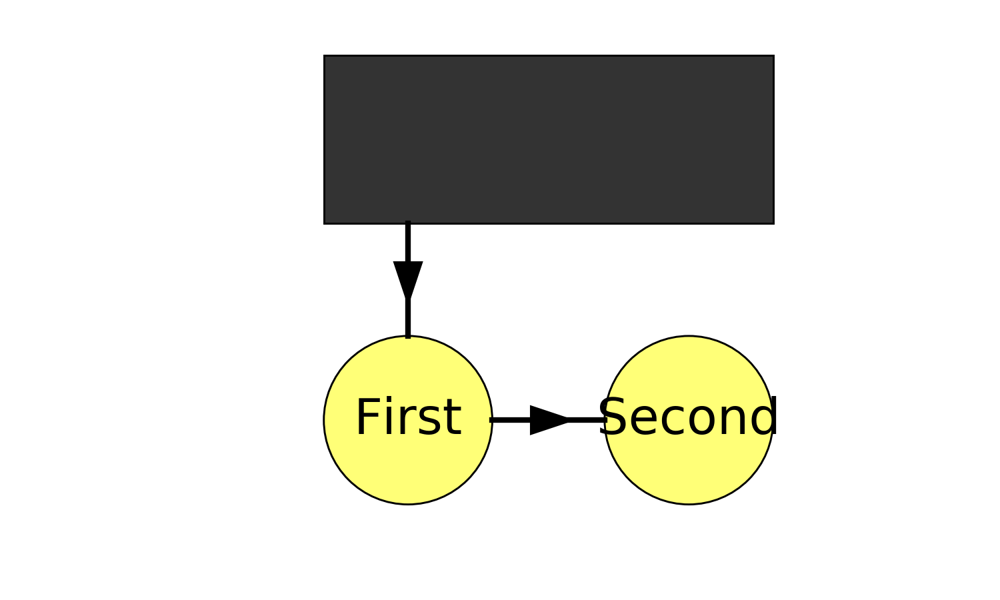

.. _tutorial:

Tutorial
========

.. toctree::
   :maxdepth: 2	

Getting started
---------------

To start using viznet, simply

.. code-block:: bash

    $ pip install viznet

or `clone/download <https://github.com/GiggleLiu/viznet.git>`_ this repository and run

.. code-block:: bash

    $ cd viznet/
    $ pip install -r requirements.txt
    $ python setup.py install

Node and Edge Brush
---------------------------
**viznet** focuses on node-edge based graphs.
Instead of directly drawing nodes and edges, a brush system is used.
The following code examplify how to draw two nodes and connection them using a directed edge.

.. code-block:: python

    >> from viznet import NodeBrush, EdgeBrush, DynamicShow
    >> with DynamicShow() as d:
    >>     brush = NodeBrush('nn.input', ax=d.ax, size='normal')
    >      node1 = brush >> (1,0)  # paint a node at (x=1, y=0)
    >>     node2 = brush >> (2,0)
    >>     edge = EdgeBrush('->-', ax=d.ax, lw=2)
    >>     edge >> (node1, node2)  # connect two nodes
    >>     node1.text('First', 'center', fontsize=18)  # add text to node1
    >>     node2.text('Second', 'center', fontsize=18)

:class:`DynamicShow` is a utility class that automatically equalize axes and then remove axes to make graph clean. :class:`NodeBrush` take the style string as its first argument, besides `basic` and `invisible` styles, styles for neural network (nn.) and tensor network (tn.) are defined as

.. image:: images/nn_theme_list.png
    :align: center

.. image:: images/tn_theme_list.png
    :align: center

:class:`EdgeBrush` take a string as style, this must must be composed of characters in [ - | . | = | > | < ],
        - '-': solid line,
        - '=': double solid line,
        - '.': dashed line,
        - '>': arrow towards end of line, no length,
        - '<': arrow towards start of line, no length.

For example,

Also, you can set color and width of your line for this :class:`EdgeBrush` by passing arguments into construction method.

:obj:`ds.ax` is nothing but a :obj:`matplotlib.Axes` instance. Now, your canvas looks like

Pins
---------------------------
The above naive connection may not be what you want, pinning is needed.
A pin is a special node, with no size, and is designed for connecting edges.
Let's continue the above example,

.. code-block:: python

    >>     mpo21 = NodeBrush('tn.mpo21', d.ax, size='normal')
    >>     node3 = mpo21 >> (1.5, 1.0)
    >>     left_bottom_pin = node3.pin('bottom', align=node1)
    >>     edge >> (left_bottom_pin, node1)

Now, your canvas looks like

Cluster-wise operations and quantum circuits
----------------------------------------------
Cluster operations like one to one connections and all to all connections between different layers in neural network are frequently used APIs.

For a quantum circuit, we also have a facility :class:`viznet.QuantumCircuit` to help us build it easily.

Read some examples under `path/to/viznet/apps/nn/` and `path/to/viznet/apps/qc/` to learn about them.
Also, :ref:`examples` chapter of this documentation gives some examples.
